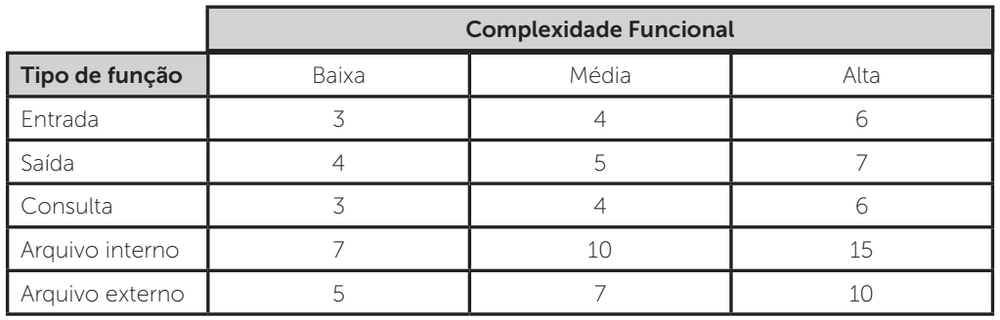

# Avaliação ST - PF

Tópicos avançados em engenharia de software

## Objetivo
Desenvolver uma aplicação que apoie o processo de medição da empresa: coletando,
armazenando, analisando e relatando dados objetivos relacionados às [métricas](#métricas) e testes e assim apoiar
os objetivos organizacionais de qualidade.

## Aplicativo em produção
Este projeto está em produção no heroku. Você pode testar o aplicativo de forma online [aqui](https://nasa-challenge-flask-example.herokuapp.com/).

## Métricas
A seguir constam as descrições e fórmulas a respeito das métricas utilizadas para medição no projeto

##### Medidas de projeto:
Usadas para quantificar o desempenho de um projeto de software. Por exemplo, uma métrica comumente usada neste contexto 
é a porcentagem de variação no cronograma do projeto, assim expressa:


##### Análise de pontos por função

Para calcular e realizar a análise de pontos por função, inicialmente é necessário classificar os requisitos funcionais 
da seguinte forma:

**Funções do tipo dados:** representam as necessidades de dados dos usuários, de acordo com sua visão de negócio. Divide-se em:

- Arquivo Lógico Interno (ALI): elemento percebido pelo usuário e mantido internamente pelo sistema.
- Arquivo de Interface Externa (AIE): Funções do tipo transação: representam as funcionalidades de processamento de 
dados identificados pelos usuários. Existem três funções deste tipo:

    1. Entrada Externa (EE): obtém dados informados pelo usuário ou por outra aplicação e os inserem no sistema.
    2. Saída Externa (SE): obtém dados do sistema e apresentam ao cliente ou enviam a outras aplicações, sendo que pelo 
    menos um valor obtido por cálculo deve existir para que seja considerada saída externa.
    3. Consulta Externa (CE): apresenta dados da mesma forma que foram armazenados, sem cálculos ou transformações.
        
Uma vez identificadas e contadas as funções, as quantidades apuradas são classificadas como complexidade alta, média 
e baixa, conforme tabela a seguir.



 A soma dos pontos obtidos é chamada de **pontos de função não ajustados (_UFP - Unadjusted Function Points_)**. 
 Nessa etapa, já temos o tamanho funcional do aplicativo.
 
 A próxima etapa trata de classificar o projeto como um todo, levando-se em conta as 14 características a seguir:
1. **Comunicação de dados:** em que grau a comunicação de dados é requerida?
2. **Processamento de dados distribuído:** em que grau o processamento distribuído está presente?
3. **Performance:** o desempenho é fator crítico na aplicação?
4. **Uso do sistema:** o usuário deseja executar a aplicação em um equipamento já existente ou comprado e que será 
altamente utilizado?
5. **Taxa de transações:** qual o volume de transações esperado?
6. **Entrada de dados on-line:** são requeridas entrada de dados online?
7. **Eficiência do usuário final:** as funções interativas fornecidas pela aplicação enfatizam um projeto para o 
aumento da eficiência do usuário final?
8. **Atualização on-line:** há arquivos atualizados on-line?
9. **Processamento complexo:** qual o grau de complexidade do processamento interno?
10. **Reusabilidade:** em que grau o código é reutilizável?
11. **Facilidade de instalação:** em que grau o sistema é fácil de ser instalado?
12. **Facilidade de operação:** em que grau o sistema é fácil de ser operado?
13. **Múltiplos locais:** o sistema é projetado para múltiplas instalações em diferentes organizações?
14. **Facilidade para mudanças:** a aplicação é projetada de forma a facilitar mudanças?
 
Cada característica receberá uma nota de 0 a 5, dessa forma, o somatório desses fatores ficará entre 0 e 70. 
Finalmente, a fórmula para o cálculo dos pontos por função ficará da seguinte forma:


Onde: 

VAF = Value Adjustment Factor ou Fator de Ajuste da Função;

GSC = General Systems Characteristics ou Características Gerais do Sistema.

Após isso, basta multiplicar o UFP com o VAF obtido:

```
AFP = UFP x VAF
```

#### Métricas de teste ágil e de apoio ao teste unitário

- ##### Fator de teste

Evidencia o esforço de uma equipe na criação de testes de unidade, comparando-se com a quantidade de código produzido. 

Como base de medição, o fator de teste `Ti` para iteração `i` é calculado como a razão entre o número de linhas de código de teste e o número de linhas de código de produção, conforme fórmula abaixo:


Onde:

**T LOTi** = número total de linhas de código de teste na iteração `i`;

**T LOCi** = número total de linhas de código de produção na iteração `i`.

- ##### Quantidade de casos de Teste e Assertivas

A quantidade de casos de teste e assertivas fornece instrumentos para que a equipe de desenvolvimento verifique a 
evolução dos testes de unidade automatizados. Base de medição:

 e  

Onde:

**T CTi** = número total de casos de teste na iteração `i`;

**T Ai** = número total de assertivas na iteração `i`;

**T LOCi** = número total de linhas de código de produção na iteração `i`.

- ##### Porcentagem de Assertivas de Teste de Unidade Passando e Falhando

Tem como objetivo verificar a porcentagem de assertivas dos casos de teste de unidade/integração que estão passando ou 
falhando. A base de medição será dada por:

 ou  

- ##### Quantidade de Testes de Aceitação por Funcionalidades

A quantidade de testes de aceitação por funcionalidades tem como objetivo acompanhar a evolução da quantidade de testes 
de aceitação produzidos. 

Para base de medição, cada requisito representado por meio de história no XP e por meio do backlog no Scrum, são 
quebrados em tarefas que devem ser realizadas durante a iteração. Cada tarefa pode ter um ou mais casos de teste de 
aceitação que devem avaliar quando aquela tarefa estará pronta. Sua fórmula é:


Onde:

**TTAi** = número de casos de teste de aceitação na iteração `i`;

**TCTi** = total de casos de teste de aceitação na iteração `i`;

**TCTi-1** = total de casos de teste de aceitação na iteração anterior (`i`-1).

- ##### Porcentagem de Assertivas de Teste de Aceitação Passando e Falhando

Tem como objetivo verificar qual a porcentagem de assertivas dos testes de aceitação que estão passando ou falhando. 
A medição será dada por:

 ou 


## ESPECIFICAÇÕES TÉCNICAS

### Stack utilizada

**Python**
- Lóginas de interface para persistência de dados

**Python Flask**
- Conteúdo dinâmico nas páginas html da aplicação
- Configuração de rotas das páginas da aplicação e das APIs

**Html, Css, Javascript**
- Front-end da aplicação

**Postgres**
- Persistência dos dados 

### APIs

---
#### Projetos 

##### GET
Backup de todos os projetos cadastrados

**Payload:** 
- `microservice`: "project"

```shell script
curl -X GET -d '{"microservice": "project"}' https://otes12-st-tiagowutzke.herokuapp.com/broker
```

##### PUT
Insere novo registro de projeto

**Payload:** 
- `microservice`: "project"
- `payload`: 
```json 
{
    "description": <descricao do projeto (string)>
}
```


```shell script
curl -X PUT -d '{"microservice": "project", "payload": {"description": "Teste"}}' https://otes12-st-tiagowutzke.herokuapp.com/broker
```

##### DELETE
Remove um registro de projeto

**Payload:** 
- `microservice`: "project"
- `payload`: {"id": id_do_projeto}

Onde `id_do_projeto` é um número inteiro
```shell script
 curl -X DELETE -d '{"microservice": "project", "payload": {"id": 9}}' localhost:8000/broker
```
---
#### Assertivas - Caso de teste 

##### GET
Backup de todas as assertivas registradas

**Payload:** 
- `microservice`: "assertive_case_test"

```shell script
curl -X GET -d '{"microservice": "assertive_case_test"}' https://otes12-st-tiagowutzke.herokuapp.com/broker
```

##### PUT
Insere novo registro de assertiva caso de teste 

**Payload:** 
- `microservice`: "assertive_case_test"
- `payload`: 
```json 
{
    "total_test_cases": <total de caso de testes (int)>,
    "total_assertives": <total de assertivas (int)>,
    "test_cases_quantity": <total de quantidade de casos de teste (int)>,
    "assertives": <total de assetivas (int)>,
    "project_id": <id do projeto relacionado às metricas (int)>,
}
```

##### DELETE
Remove um registro de assertiva caso de teste 

**Payload:** 
- `microservice`: "assertive_case_test"
- `payload`: {"id": id_do_registro}

Onde `id_do_registro` é um número inteiro
```shell script
 curl -X DELETE -d '{"microservice": "assertive_case_test", "payload": {"id": 9}}' localhost:8000/broker
```

---
#### Percentual de assertivas 

##### GET
Backup de todos os registros de percentual de assertivas

**Payload:** 
- `microservice`: "assertives_percentage"

```shell script
curl -X GET -d '{"microservice": "assertives_percentage"}' https://otes12-st-tiagowutzke.herokuapp.com/broker
```

##### PUT
Insere novo registro de percentual de assertivas 

**Payload:** 
- `microservice`: "assertives_percentage"
- `payload`: 
```json 
{
    "pass_assertives": <total de assertivas passando (int)>,
    "fail_assertives": <total de assertivas falhando (int)>,
    "project_id": <id do projeto relacionado às metricas (int)>,
}
```

##### DELETE
Remove um registro de percentual de assertivas 

**Payload:** 
- `microservice`: "assertives_percentage"
- `payload`: {"id": id_do_registro}

Onde `id_do_projeto` é um número inteiro
```shell script
 curl -X DELETE -d '{"microservice": "assertives_percentage", "payload": {"id": 9}}' localhost:8000/broker
```
---
#### Aceitação de funcionalidades 

##### GET
Backup de todos os registros de aceitação de funcionalidades

**Payload:** 
- `microservice`: "feature_acceptance"

```shell script
curl -X GET -d '{"microservice": "feature_acceptance"}' https://otes12-st-tiagowutzke.herokuapp.com/broker
```

##### PUT
Insere novo registro de aceitação de funcionalidades 

**Payload:** 
- `microservice`: "feature_acceptance"
- `payload`: 
```json 
{
    "test_cases": <total de casos de teste (int)>,
    "prev_test_cases": <total de caso de teste anterior (int)>,
    "acceptance_cases": <numero de casos de aceitação (int)>,
    "project_id": <id do projeto relacionado às metricas (int)>,
}
```

##### DELETE
Remove um registro de percentual de assertivas 

**Payload:** 
- `microservice`: "feature_acceptance"
- `payload`: {"id": id_do_registro}

Onde `id_do_registro` é um número inteiro
```shell script
 curl -X DELETE -d '{"microservice": "feature_acceptance", "payload": {"id": 9}}' localhost:8000/broker
```

---
#### Pontos por função 

##### GET
Backup de todos os registros de pontos por função

**Payload:** 
- `microservice`: "function_points"

```shell script
curl -X GET -d '{"microservice": "function_points"}' https://otes12-st-tiagowutzke.herokuapp.com/broker
```

##### PUT
_Não possui este método, pois essa métrica é resultado de outros dados._


##### DELETE
Remove um registro de percentual de assertivas 

**Payload:** 
- `microservice`: "function_points"
- `payload`: {"id": id_do_registro}

Onde `id_do_registro` é um número inteiro
```shell script
 curl -X DELETE -d '{"microservice": "function_points", "payload": {"id": 9}}' localhost:8000/broker
```

---
#### Medidas de projeto 

##### GET
Backup de todos os registros de medidas de projeto

**Payload:** 
- `microservice`: "project_measure"

```shell script
curl -X GET -d '{"microservice": "project_measure"}' https://otes12-st-tiagowutzke.herokuapp.com/broker
```

##### PUT
Insere novo registro de medidas de projeto 

**Payload:** 
- `microservice`: "project_measure"
- `payload`: 
```json 
{
    "real_date_finish": <data real de término (date)>,
    "plan_date_finish": <data planejada de término (date)>,
    "real_date_begin": <data real de início (date)>,
    "project_id": <id do projeto relacionado às metricas (int)>,
}
```


##### DELETE
Remove um registro de medidas de projeto 

**Payload:** 
- `microservice`: "project_measure"
- `payload`: {"id": id_do_registro}

Onde `id_do_registro` é um número inteiro
```shell script
 curl -X DELETE -d '{"microservice": "project_measure", "payload": {"id": 9}}' localhost:8000/broker
```

---
#### Caracteristicas gerais do sistema 

##### GET
Backup de todos os registros de características gerais do sistema

**Payload:** 
- `microservice`: "system_general_features"

```shell script
curl -X GET -d '{"microservice": "system_general_features"}' https://otes12-st-tiagowutzke.herokuapp.com/broker
```

##### PUT
Insere novo registro de características gerais do sistema 

**Payload:** 
- `microservice`: "system_general_features"
- `payload`: 
```json 
{
    "real_date_finish": <data real de término (date)>,
    "plan_date_finish": <data planejada de término (date)>,
    "real_date_begin": <data real de início (date)>,
    "project_id": <id do projeto relacionado às metricas (int)>,
}
```


##### DELETE
Remove um registro de características gerais do sistema 

**Payload:** 
- `microservice`: "system_general_features"
- `payload`: {"id": id_do_registro}

Onde `id_do_registro` é um número inteiro
```shell script
 curl -X DELETE -d '{"microservice": "system_general_features", "payload": {"id": 9}}' localhost:8000/broker
```
---
#### Fator de teste 

##### GET
Backup de todos os registros de fator de teste

**Payload:** 
- `microservice`: "test_factor"

```shell script
curl -X GET -d '{"microservice": "test_factor"}' https://otes12-st-tiagowutzke.herokuapp.com/broker
```

##### PUT
Insere novo registro de fator de teste 

**Payload:** 
- `microservice`: "test_factor"
- `payload`: 
```json 
{
    "total_lines_test": <total de linhas de teste (date)>,
    "total_lines_prod": <total de linhas de produção (date)>,
    "project_id": <id do projeto relacionado às metricas (int)>,
}
```


##### DELETE
Remove um registro de fator de teste 

**Payload:** 
- `microservice`: "test_factor"
- `payload`: {"id": id_do_registro}

Onde `id_do_registro` é um número inteiro
```shell script
 curl -X DELETE -d '{"microservice": "test_factor", "payload": {"id": 9}}' localhost:8000/broker
```

---
#### Pontos de função não ajustados 

##### GET
Backup de todos os registros de pontos de função não ajustados

**Payload:** 
- `microservice`: "unadjusted_function_points"

```shell script
curl -X GET -d '{"microservice": "unadjusted_function_points"}' https://otes12-st-tiagowutzke.herokuapp.com/broker
```

##### PUT
Insere novo registro de de pontos de função não ajustados 

**Payload:** 
- `microservice`: "unadjusted_function_points"
- `payload`: 
```json 
{
    "complex": <complexidade (date)>,
    "internal_logic_file": <arquivo interno lógico (date)>,
    "external_interface_file": <arquivo de interface externa (int)>,
    "external_inputs": <entradas externas (int)>,
    "external_outputs": <saidas externas (int)>,
    "external_queries": <consultas externas (int)>,
    "project_id": <id do projeto (int)>,
}
```


##### DELETE
Remove um registro de fator de teste 

**Payload:** 
- `microservice`: "unadjusted_function_points"
- `payload`: {"id": id_do_registro}

Onde `id_do_registro` é um número inteiro
```shell script
 curl -X DELETE -d '{"microservice": "unadjusted_function_points", "payload": {"id": 9}}' localhost:8000/broker
```

